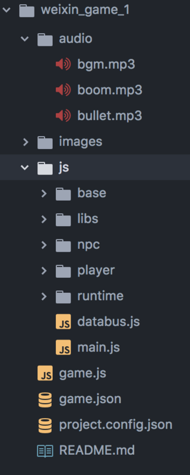
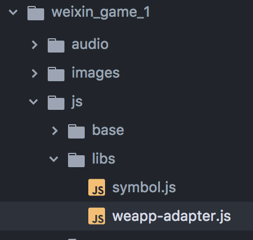

## 了解微信小游戏 ##
[官方文档][1]有详细的介绍

## 小游戏的文件结构 ##
####我们以新建一个官方示例说明####



如图 最外层除了readme外 有3个文件

 - `game.js` 程序入口
 - `game.json`小游戏配置文件
 - `project.config.json` 项目设置文件

具体配置可以查看官方文档，只有这几个文件需要按照文件名格式来写，其他文件的内容和




这个文件是官方示例中用于模拟浏览器环境的适配器，如有需要可以自己写，我们这里沿用这个。

入口文件 game.js

```
import './js/libs/weapp-adapter'
import './js/libs/symbol'

import Main from './js/main'

new Main()

```
整个微信小游戏实际上是运行在微信框架中一个原生canvas中，没有浏览器页面环境如document（这就是为什么有一个模拟浏览器环境的适配器），启动时小游戏框架运行game.js，然后在main.js中基本上都是对微信小游戏api的调用及原生canvas的操作了。如果之前使用过原生canvas或者其他canvas库的同学 马上就可以上手开发0成本，官方开发工具也有es6=》es5的转换所以如果项目比较小都不用其他东西，直接文本编辑器修改 保存 查看 即可。

![图片描述][2]

## 开工 ##

 1. 音频使用原来的代码
 2. 帧定时也使用wx的回调函数

    ```
    window.requestAnimationFrame(
          this.TimerHandel.bind(this),
          canvas
        )
    ```

 3. 引入一个canvas2d库createjs中的ease 和一个自己写的工具库

    ```
    import './js/libs/weapp-adapter'
    import './js/libs/ease'
    import './js/plugin/Math'

    import Main from './js/main'
    window.main = new Main();

    ```

 4. 保留原来的触摸移动飞机并且新增重力感应移动飞机

    ```
    this.initEvent();
    wx.startAccelerometer({ success:()=>{console.log('开始监听加速计')}});
    wx.onAccelerometerChange((res)=>{
      this.player.speedx = Math.floor(res.x*100)/10;
      this.player.speedy = Math.floor(-res.y * 100)/10;
    })
    ```

 5. 其他全部删除 基于create.js库重写；所有子弹继承一个父类

    ```
    export default class Bullet_Super {

        constructor(cantiner, SHOOT_FRAME = 10,sprite_sheet) {
            this.cantiner = cantiner;
            this.shoot_frame = SHOOT_FRAME;
            this.list = [];
            this.deletelist = [];
            this.y = 0;
            this.x = 0;

            this.spriteSheet = new createjs.SpriteSheet(sprite_sheet);
        }
        outOfScreen(s, test) {
            if (test) {
                if (s.y > window.innerHeight + 100 || s.x > window.innerWidth + 100 || s.x < -100) {
                    this.deletelist.push(s);
                    s.visible = false;
                    return false;
                }
            }
            return true;
        }
        createSprite(anime, option, die_option) {
            let isnew = true;
            let sprite = this.deletelist.length > 0
                ? (isnew = false, this.deletelist.shift())
                : new createjs.Sprite(this.spriteSheet, anime);
            sprite.isdie = false;
            sprite.dieing_frame=0;
            sprite.diecount = 0;
            Object.assign(sprite, option);
            sprite.die = sprite.die || (() => {
                sprite.isdie = true;
                Object.assign(sprite, die_option);
            });
            !isnew
                ? (sprite.visible = true, sprite.gotoAndPlay(anime))
                : this.cantiner.addChild(sprite);
            this.list.push(sprite);
        }
        update(timeFunc, dieFunc, diedFunc, test) {
            this.list = this.list.filter((s) => {
                if (s.isdie) {
                    s.diecount++;
                    dieFunc(s);
                    if (s.diecount > (s.dieing_frame)) {
                        diedFunc(s);
                        this.deletelist.push(s);
                        s.visible = false;
                        return false;
                    }
                    return true;
                }
                timeFunc(s);
                return this.outOfScreen(s, test);
            });
        }
    }
    ```

 6. 之后就是实现各种弹幕，计分显示等

具体移步github https://github.com/lichddd/weixin_game_test1
b站演示https://www.bilibili.com/video/av19046982/

  [1]: https://mp.weixin.qq.com/debug/wxagame/dev/index.html
  [2]: assets/3.png
